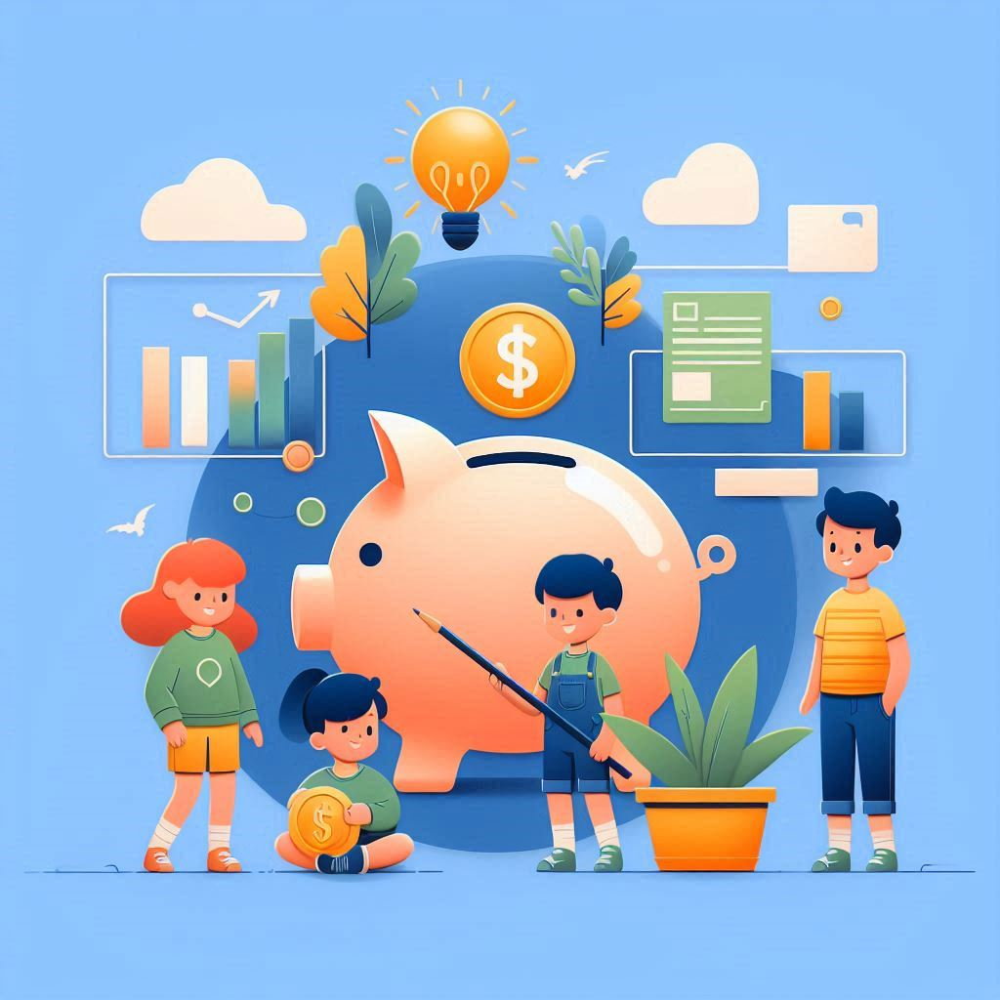

# Dicas de Economia para Crianças e Jovens

## 📒 Descrição

Um eBook educativo com dicas para crianças e jovens aprenderem sobre economia e como economizar dinheiro.

## 🤖 Tecnologias Utilizadas

-   ChatGPT (IA Generativa) para criação do conteúdo
-   Designer da Microsoft para a criação da capa do eBook

## 🧐 Processo de Criação
1.  **Criação do Conteúdo**: Uso do ChatGPT para desenvolver textos educativos e acessíveis.
2.  **Design da Capa**: Utilização do Designer da Microsoft para criar uma capa atraente.

## 🚀 Resultados

### Capítulo 1: O Que É Economia?

Economia é sobre como usamos nosso dinheiro e recursos. É importante entender para tomar boas decisões financeiras no futuro.

#### Conceitos Básicos

-   **Dinheiro**: É o que usamos para comprar coisas.
-   **Orçamento**: Um plano de quanto dinheiro temos e como vamos gastá-lo.
-   **Economizar**: Guardar dinheiro para o futuro.

----------

### Capítulo 2: A Importância de Economizar

Economizar dinheiro é importante para estar preparado para o futuro e para emergências.

#### Por Que Economizar?

-   **Emergências**: Ter dinheiro guardado para situações inesperadas.
-   **Objetivos**: Economizar para comprar algo especial no futuro.
-   **Independência**: Aprender a gerenciar seu próprio dinheiro.

----------

### Capítulo 3: Como Economizar Dinheiro

Aqui estão algumas dicas práticas para começar a economizar dinheiro.

#### Dicas de Economia

-   **Mesada**: Separe uma parte da sua mesada para economizar.
-   **Cofrinho**: Use um cofrinho para guardar moedas e notas.
-   **Lista de Compras**: Faça uma lista antes de comprar para evitar gastos desnecessários.

----------

### Capítulo 4: Entendendo Orçamento

Fazer um orçamento é planejar como você vai usar seu dinheiro.

#### Criando um Orçamento

-   **Entradas**: Anote quanto dinheiro você ganha.
-   **Saídas**: Anote quanto dinheiro você gasta.
-   **Saldo**: Verifique se você está gastando menos do que ganha.

----------

### Capítulo 5: Objetivos Financeiros

Ter objetivos ajuda a manter a motivação para economizar.

#### Como Definir Objetivos

-   **Curto Prazo**: Algo que você quer comprar logo, como um brinquedo.
-   **Médio Prazo**: Algo para alguns meses, como uma bicicleta.
-   **Longo Prazo**: Algo para o futuro distante, como um videogame.

----------

### Capítulo 6: Aprendendo com Jogos e Brincadeiras

Aprender sobre economia pode ser divertido com jogos e brincadeiras.

#### Jogos Educativos

-   **Monopoly**: Jogo de tabuleiro sobre compra e venda de propriedades.
-   **Aplicativos**: Use apps que ensinam sobre economia de forma divertida.

----------

### Capítulo 7: A Importância de Fazer Boas Escolhas

Tomar boas decisões financeiras é essencial para uma vida saudável e sem dívidas.

#### Como Fazer Boas Escolhas

-   **Pesquise Preços**: Compare antes de comprar.
-   **Pense Antes de Comprar**: Pergunte se você realmente precisa daquilo.
-   **Evite Compras por Impulso**: Não compre só porque viu algo legal.

----------

### Capítulo 8: O Futuro e Você

Pensar no futuro é importante, mesmo sendo jovem.

#### Planeje Seu Futuro

-   **Estudos**: Estudar e aprender sobre economia.
-   **Carreira**: Pense em como ganhar dinheiro no futuro.
-   **Investimentos**: Aprender sobre investir pode ajudar seu dinheiro crescer.

----------

## Conclusão

Economizar dinheiro e aprender sobre economia são habilidades importantes para toda a vida. Com essas dicas, você estará no caminho certo para ser um bom gestor do seu dinheiro!